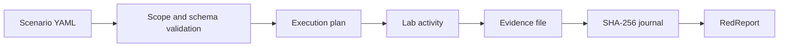
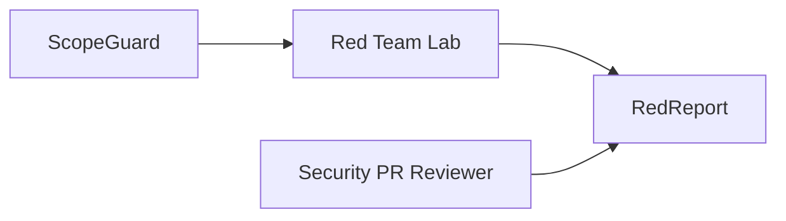

<h1 align="center">Red Team Lab</h1>

<p align="center">
  <strong>Planejamento de cenários, rastreabilidade MITRE ATT&CK e cadeia de custódia de evidências para laboratórios reproduzíveis.</strong>
</p>

<p align="center">
  <a href="https://github.com/guuszz/redteam-lab/actions/workflows/ci.yml"></a>
  
  
  <a href="LICENSE"></a>
</p>

## Por que este projeto existe

Um bom exercício ofensivo precisa mostrar mais que comandos: **escopo, hipótese, técnica, evidência, resultado e limpeza**. O Red Team Lab transforma esses elementos em um fluxo verificável e versionável.

O MVP oferece:

- cenários declarativos em YAML;
- validação de alvos restritos a loopback, redes privadas e domínios reservados de laboratório;
- técnicas no formato MITRE ATT&CK (`T1234` ou `T1234.001`);
- plano Markdown com SHA-256 do cenário de origem;
- diário append-only em NDJSON;
- SHA-256 de cada evidência registrada;
- acompanhamento do último estado de cada etapa.
- exportação de achados confirmados para um projeto RedReport completo.

## Fluxo



## Instalação

```bash
git clone https://github.com/guuszz/redteam-lab.git
cd redteam-lab
python -m venv .venv
source .venv/bin/activate  # Windows: .venv\Scripts\activate
python -m pip install -e ".[dev]"
```

## Uso

### 1. Validar o cenário

```bash
rtl validate scenarios/web-foothold.yml
```

```text
VALID: web-foothold-lab (4 steps)
```

### 2. Gerar o plano de execução

```bash
rtl plan scenarios/web-foothold.yml --output reports/generated/web-foothold-plan.md
```

O plano inclui sequência, objetivo, ATT&CK ID, evidência esperada, cleanup, condições de parada e hash do YAML.

### 3. Registrar uma evidência

```bash
rtl record scenarios/web-foothold.yml \
  --step service-discovery \
  --status passed \
  --evidence evidence/discovery-output.txt \
  --note "Serviços do fixture catalogados"
```

Estados aceitos: `passed`, `failed`, `blocked` e `skipped`.

### 4. Consultar progresso

```bash
rtl status scenarios/web-foothold.yml
```

```text
service-discovery        passed
web-enumeration          pending
controlled-access        pending
evidence-package         pending
```

### 5. Exportar para o RedReport

Depois de registrar como `passed` uma etapa que contém o bloco `finding`:

```bash
rtl export redreport scenarios/web-foothold.yml \
  --journal evidence/runs/journal.ndjson \
  --output reports/generated/redreport-project \
  --client "Portfolio Lab" \
  --start-date 2026-08-10 \
  --end-date 2026-08-10

redreport validate reports/generated/redreport-project
redreport build reports/generated/redreport-project
```

O exportador copia as evidências, preserva o SHA-256 no finding e gera `report.yaml` e `findings/RTL-NNN.yaml` no schema nativo do RedReport.

## Estrutura de cenário

```yaml
id: fixture-lab
name: Fixture exercise
description: Objetivo mensurável do cenário.
scope:
  targets: [192.168.56.10, api.target.test]
  exclusions: [192.168.56.1]
safety:
  stop_conditions:
    - Stop on service instability.
steps:
  - id: service-discovery
    name: Identify fixture services
    technique: T1046
    tactic: Discovery
    objective: Inventory the expected attack surface.
    expected_evidence: [discovery-output.txt]
    cleanup: Remove temporary output after hashing.
```

## Integração com o portfólio



- **ScopeGuard:** normaliza e aprova o conjunto de alvos.
- **Red Team Lab:** organiza cenário, ATT&CK, execução e evidências.
- **RedReport:** transforma findings validados no relatório final.
- **Security PR Reviewer:** adiciona achados AppSec ao mesmo pipeline de reporting.

## Qualidade

```bash
python -m ruff check .
python -m pytest
python -m build
```

A CI executa os três gates em cada Pull Request.

## Roadmap

- [x] exportador de findings compatível com RedReport;
- [ ] matriz ATT&CK Navigator por cenário;
- [ ] manifest assinado de evidências;
- [ ] adaptadores para logs Windows, Linux e aplicação web;
- [ ] dashboard local de cobertura e progresso.

## Licença

[MIT](LICENSE)
